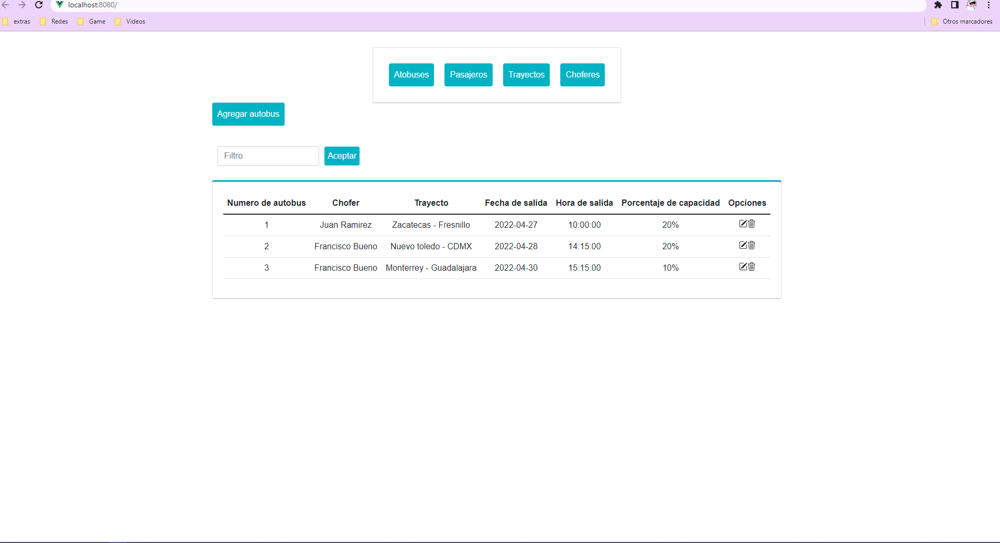

#
# Primero para correr el pryecto back end debemos instalar python3

### 1.- Para instalarlo en windows debemos ir a la pagina oficial y descargar el instalador
### 2.- Para instalarlo en linux/unix debemos correr el comando recomendado para cada distro.
### 3.- Intalar Pip3 en el respencivo ambiente.

### 4.- Al instalar pip3 debemos instalar el virtualenv de pip3
```
pip3 install virtualenv
```
### 5.- Debemos ubicarnos una carpeta anterior al proyecto y ejecutar el comando para crear el virtualenv.
```
virtualenv mi_entornovirual
```
### 6.- Para activar el entornoo vitual debemos ejecutar el siguiente comando
#### Para windows:
```
. mi_entornovirtual/scripts/activate
```
#### Para linux:
```
. mi_entornovirtual/bin/activate
```
#### Descativamos en ambios ambientes con el comando:
```
deactivate
```
### 7.- Una vez que tengamos el virtualenv activado ejecutamos para instalar las dependencias del proyecto en el back dentro de la carpeta del proyecto:
```
cd BusDestacame/

pip3 install -r requirements.txt
```
### 8.- Debemos ejecutar las migraciones:
- Primero el comando:
```
python manage.py makemigrations
```
- despues el comando:
```
python manage.py migrate
```

### 9.- Podemos correcto el preocto con el comando:
```
pip3 install -r requirements.txt
```
 ### 10.- Entramos a la sigueinte ruta para ver que el proyecto efectivamente esta corriendo:
```
http://127.0.0.1:8000/
```
- Veremos esta pagina:

#
# Para correr el proyecto frontend que se encuentra dentro de la carptea app y debemos tener el paquete nvm de node o node instalados.

### Debemos tener corriendo en paralelo el proyecto de Django (BACK) y el proyecto de Vue (front) asi que debemos tener dos consolas abiertas.

### 1.- Dentro de la carpeta del proyecto ejecutamos:

```
cd app/
```
### 2.- Al esta en la ruta BusDestacame/app ejecutamos para instalar todas las dependencias:

```
npm install
```

### 3.- Para correr el proyecto debemos de ejecutar:

```
npm run serve
```

### 4.- Entramos a la siguiente ruta:
```
 http://localhost:8080/
```
### 5.- De igual manera podremos ver la siguiente pagina:



#
# ¡Listo tenemos el proyecto corriendo!

# Estructura de la base de datos:


